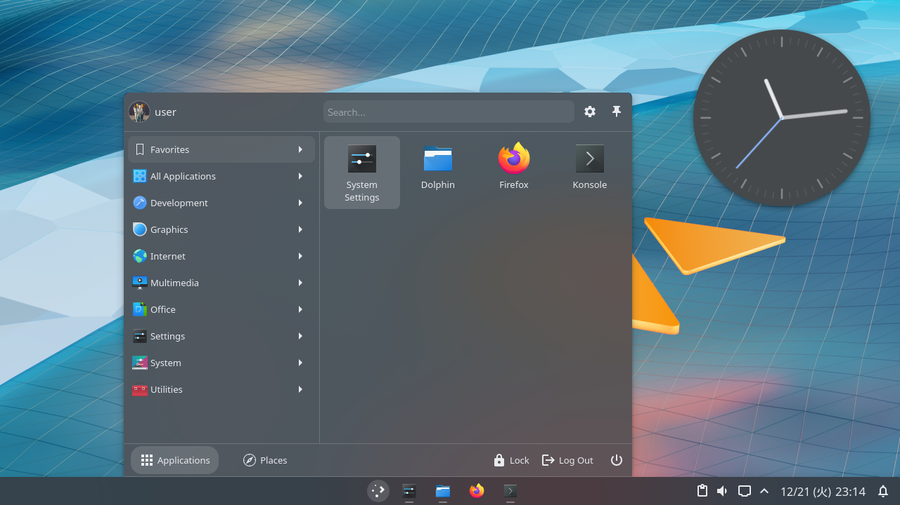

# Mica Plasma Theme

Mica is a Plasma theme inspired by [Material Design 3](https://m3.material.io).

Currently this project is a WIP and some icons and widgets are not yet properly themed.

## Notice

This theme requires the panel height to be **40px or higher**, otherwise
tab-like widgets in the panel will look broken.

The recommended panel height is 40px.

## Supported Plasma Version

5.23.0 or later

## Installation

Using `meson` to install:

```sh
# Remove --prefix if you prefer a global installation
meson _build --prefix=$HOME/.local
meson install -C _build
```

Or simply:

```sh
cp -r mica ~/.local/share/plasma/desktoptheme
```

## Preview



<sub>[Wallpaper link](https://wallup.net/digital-art-simple-background/) | Font: [M PLUS 1](https://github.com/coz-m/MPLUS_FONTS), 9.75pt</sub>
